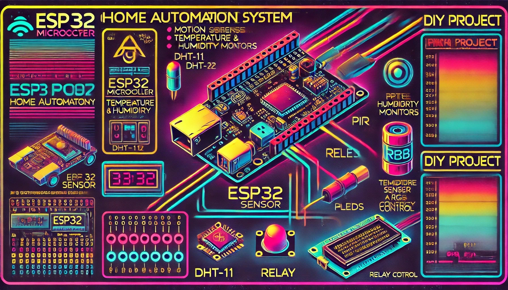
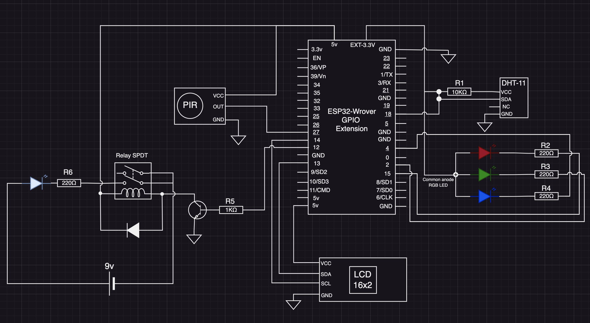
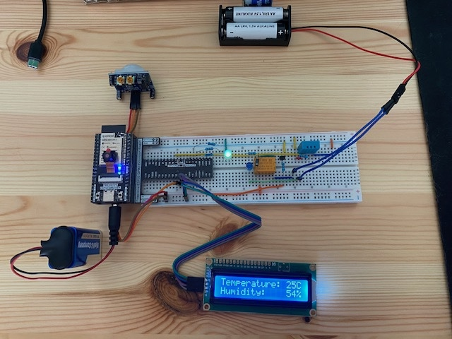
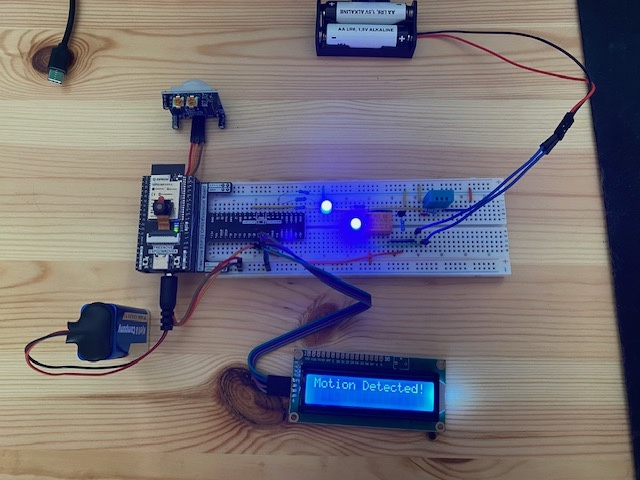

# Home Automation System with ESP32

**A comprehensive module integrating motion detection, temperature and humidity monitoring, RGB LED control, and relay switching functionalities.**

## Table of Contents
1. [Project Description](#project-description)
2. [Components and Pin Configurations](#components-and-pin-configurations)
   - [LCD1602](#lcd1602)
   - [PIR Sensor](#pir-sensor)
   - [Pin Settings](#pin-settings)
3. [Project Diagram](#project-diagram)
4. [Components List](#components-list)
5. [Additional Information and Resources](#additional-information-and-resources)
   - [ESP32 Datasheets](#esp32-datasheets)
   - [Component Datasheets](#component-datasheets)
   - [GitHub Repositories](#github-repositories)

## Project Description
This project implements a home automation system using an ESP32 microcontroller. The system integrates various sensors to detect motion, monitor temperature and humidity, and control an RGB LED and a relay. The project demonstrates the use of FreeRTOS tasks to manage concurrent operations and showcases efficient utilization of I2C and GPIO interfaces for sensors. The system also includes an LCD screen to display temperature, humidity, and motion detected by the PIR sensor. The RGB LED changes color based on temperature and motion detection, while the PIR sensor activates a relay to turn on an external battery-powered lamp.

## Getting Started

### Prerequisites
- ESP32 development board
- USB cable to connect ESP32 to your computer
- ESP-IDF Visual Studio Code Extension

### Installation

- [vscode-esp-idf-extension](https://github.com/espressif/vscode-esp-idf-extension)
- [ESP-IDF Get Started](https://docs.espressif.com/projects/esp-idf/en/v4.3.1/esp32/get-started/index.html#introduction)

### Configuration
- Adjust the pin settings in the `config.h` file if necessary.
- Ensure all connections are secure according to the project diagram.

 

## Components and Pin Configurations

### LCD1602
The LCD screen is controlled via the I2C interface, with programmatic pull-up resistors configured in the software.

- **I2C_MASTER_SCL_IO:** GPIO_NUM_14
- **I2C_MASTER_SDA_IO:** GPIO_NUM_13

### PIR Sensor
The PIR sensor is connected with a programmatic pull-up resistor.

- **PIR_SENSOR_PIN:** GPIO_NUM_27

### Pin Settings

| Definitions       | Component       | GPIO Pin     | Interface      | Type   |
|-------------------|-----------------|--------------|----------------|--------|
| DHT11_PIN         | DHT-11          | GPIO_NUM_18  | GPIO (one-wire)| Input  |
| I2C_MASTER_SCL_IO | LCD1602 / SCL   | GPIO_NUM_14  | I2C            | Output |
| I2C_MASTER_SDA_IO | LCD1602 / SDA   | GPIO_NUM_13  | I2C            | Output |
| PIR_SENSOR_PIN    | PIR Sensor      | GPIO_NUM_27  | GPIO           | Input  |
| RELAY_PIN         | Relay           | GPIO_NUM_12  | GPIO           | Output |
| RGB_LED_RED_PIN   | RGB LED (Red)   | GPIO_NUM_15  | PWM            | Output |
| RGB_LED_GREEN_PIN | RGB LED (Green) | GPIO_NUM_2   | PWM            | Output |
| RGB_LED_BLUE_PIN  | RGB LED (Blue)  | GPIO_NUM_4   | PWM            | Output |

*The pin definitions can be found in the `config.h` file within the `components` folder.*

## Project Diagram

### Components List
| Component  | Resistance/Type      | Amount |
|------------|----------------------|--------|
| DHT-11     | Humidity/Temp Sensor | 1      |
| LCD        | 1602                 | 1      |
| PIR Sensor | Motion Sensor        | 1      |
| Relay      | SPDT                 | 1      |
| RGB LED    | Common Anode         | 1      |
| Resistor   | 220kΩ                | 4      |
| Resistor   | 1KΩ                  | 1      |
| Resistor   | 10KΩ                 | 1      |
| Transisor  | NPN                  | 1      |
| LED        | Blue                 | 1      |
| Diode      | rectifier            | 1      |
| Battery    | 9v                   | 1      |

 

 

## Additional Information and Resources

### ESP32 Datasheets
- [ESP32-WROVER-E & ESP32-WROVER-IE Datasheet](https://www.espressif.com/sites/default/files/documentation/esp32-wrover-e_esp32-wrover-ie_datasheet_en.pdf)
- [ESP32 Datasheet](https://www.espressif.com/sites/default/files/documentation/esp32_datasheet_en.pdf)
- [ESP32 Pinout](https://github.com/Freenove/Freenove_Ultimate_Starter_Kit_for_ESP32/blob/master/Datasheet/ESP32-Pinout.pdf)
- [Freenove Starter kit](https://github.com/Freenove/Freenove_Ultimate_Starter_Kit_for_ESP32/tree/master)

### Component Datasheets

- [PIR Sensor Datasheet](https://cdn-learn.adafruit.com/downloads/pdf/pir-passive-infrared-proximity-motion-sensor.pdf)
- [DHT-11 Datasheet](https://components101.com/sites/default/files/component_datasheet/DFR0067%20DHT11%20Datasheet.pdf)
- [RGB LED Datasheet](https://components101.com/sites/default/files/component_datasheet/RGB%20LED.pdf)
- [LCD-1602 Datasheet](https://github.com/Freenove/Freenove_Ultimate_Starter_Kit_for_ESP32/blob/master/Datasheet/LCD1602.pdf)
- [Relay Datasheet](https://www.datasheetcafe.com/hk4100f-dc5v-shg-datasheet-relay/)

### GitHub Repositories

- [zorxx DHT GitHub Repository](https://github.com/zorxx/dht/tree/main)
- [Espressif LCD GitHub Repository](https://github.com/espressif/esp-idf/tree/master/examples/peripherals/spi_master/lcd)
